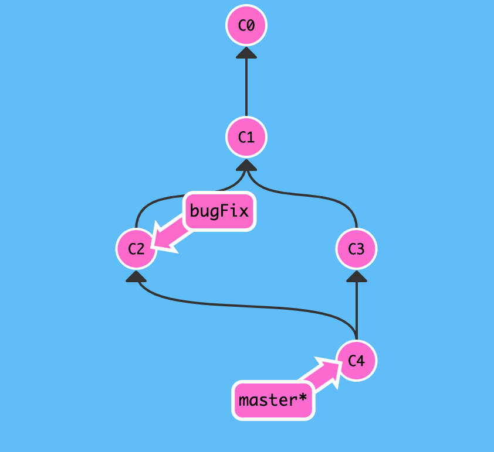
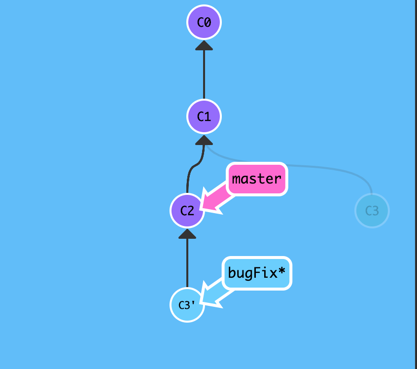
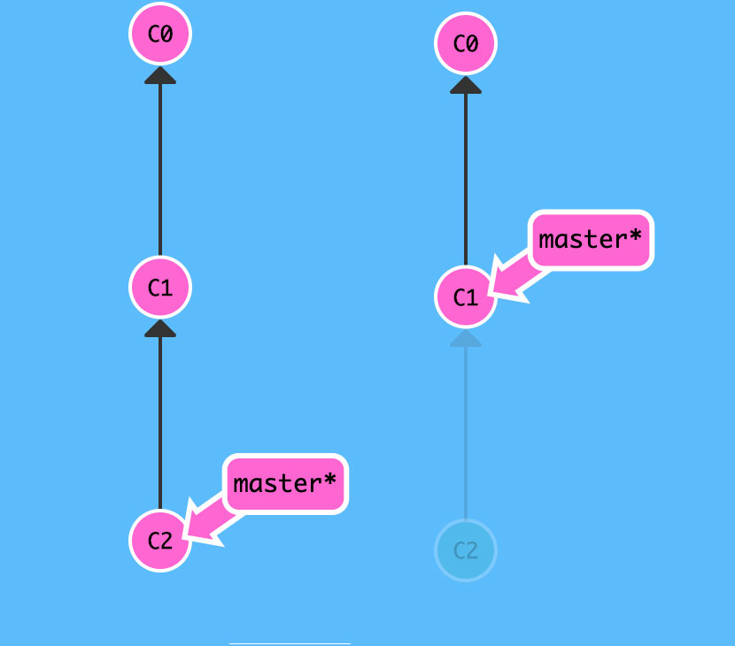
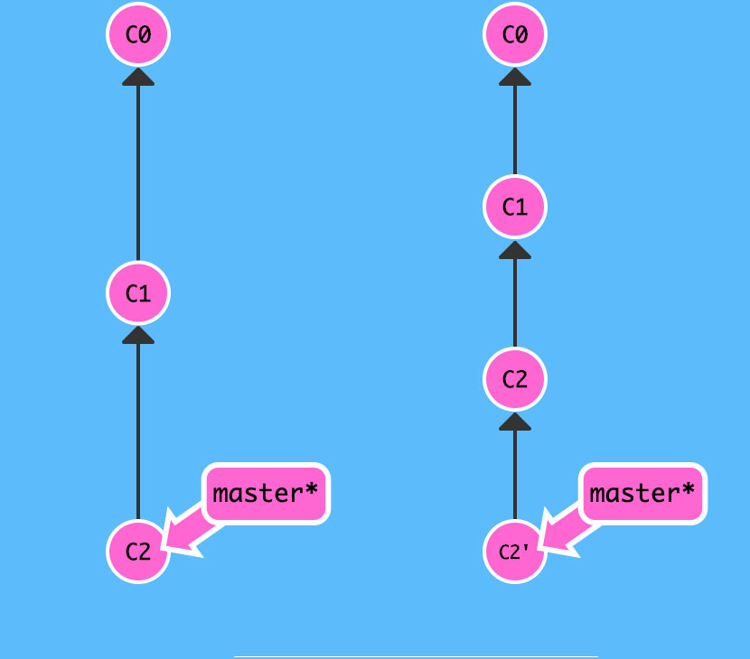
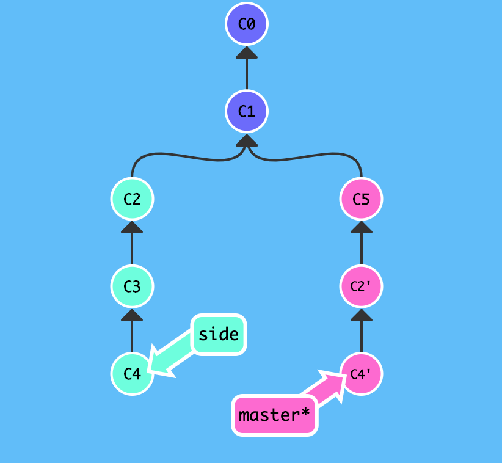

# Git 学习总结

## 1.Git基础

### 基础命令

* `git commit：` 保存的是你的目录下所有文件的快照，每次提交可能地轻量，因此在你每次进行提交时，它并不会盲目地复制整个目录。条件允许的情况下，它会将当前版本与仓库中的上一个版本进行对比，并把所有的差异打包到一起作为一个提交记录。

* `git branch：` git分支仅仅指向某个提交记录。多分支不会造成储存或内存上的开销，并且按逻辑分解工作到不同的分支要比维护那些特别臃肿的分支简单多了。(分支与提交记录协同工作)

* 分支与合并：
  * `git merge` 在 Git 中合并两个分支时会产生一个特殊的提交记录，它有两个父节点。翻译成自然语言相当于：“我要把这两个父节点本身及它们所有的祖先都包含进来。”
  
  * `git rebase` 取出一系列的提交记录，复制到另外一个地方逐一的排列下去，优势在于创建线性提交记录。
  

### 高级命令

* `HEAD`一个对当前检出记录的符号引用 —— 也就是指向你正在其基础上进行工作的提交记录。
  * 可通过 `cat .git/HEAD`或`git symbolic-ref HEAD`查看当前HEAD指向的提交记录。
  * 相对引用: 通过 `HEAD^`上移一个记录或者`git checkout HEAD~[num]`移动多条记录，完成当前的HEAD指向。
* 撤销变更：撤销变更由底层部分（暂存区的独立文件或者片段）和上层部分（变更到底是通过哪种方式被撤销的）组成
  * git reset: 完成local即本地分支撤销。通过把分支记录回退几个提交记录来实现撤销改动。你可以将这想象成“改写历史”。git reset 向上移动分支，原来指向的提交记录就跟从来没有提交过一样
  
  * git revert: 完成远程分支撤销。产生新的提交记录，新提交记录 C2' 引入了更改 —— 这些更改刚好是用来撤销 C2 这个提交的。也就是说 C2' 的状态与 C1 是相同的。revert 之后就可以把你的更改推送到远程仓库与别人分享啦。
  
 
* 整理提交记录
  * `git cherry-pick <提交号>...`如果你想将一些提交复制到当前所在的位置（HEAD）下面的话，Cherry-pick 是最直接的方式了。【关键点】需要记住每个提交的commitID

  
  *`交互式的 rebase` 需要基于一个分支或者一个commit
  ID来设置你当前的分支的基线，这基线就是当前分支的开始时间轴向后移动到最新的跟踪分支的最后面，这样你的当前分支就是最新的跟踪分支。这里的操作是基于文件事务处理的，所以你不用怕中间失败会影响文件的一致性。在中间的过程中你可以随时取消rebase 事务。git rebase –abort；

  hello


### 1.1 获取git仓库的方法

* 对现有工作目录启用`git`项目管理使用`git init`命令初始化，出现`.git`的目录，所有 Git 需要的数据和资源都存放在这个目录中。（此时只是对预做版本控制的项目做了，结构框架的初始化工作）。

```javascript
// 后续需要对需要做版本控制的文件做如下操作
git add *.C  // 添加预加入版本控制的文件

git commit -m "init project manage" // 添加修改文件到暂存区域的信息说明

git push  // push到远程仓库
```

* 从现有仓库克隆源码，具体命令格式`git clone [url]`

```javascript
`git clone git://github.com/schacon/grit.git [rename]`// 本地创建一个命名为[rename]或grit的工作目录
```

### 1.2 记录更新仓库的状态

对于现有工作目录的文件跟踪分为如下两类：已跟踪和未跟踪。

* 已跟踪: 已经纳入到版本控制的文件，在上次快照中有这些文件的记录，经过一段时间的工作后，其状态可分为：未更新、已修改、已放入暂存区域。
* 未跟踪: 未在上次快照记录中，且不在当前暂存区域。

具体状态更新图如下


---
检查文件状态基本命令

* 有文件本修改的状态

``` javascript
    // 当前分支
    // 1、已跟踪文件 git.md 已修改但未放到暂存区域
    // 2、未跟踪文件 git-status-process.png 文件
    git status
    On branch versionChange
    Your branch is up-to-date with 'origin/versionChange'.

    Changes not staged for commit:
    (use "git add <file>..." to update what will be committed)
    (use "git checkout -- <file>..." to discard changes in working directory)

        modified:   git.md

    Untracked files:
    (use "git add <file>..." to include in what will be committed)

        git-status-process.png

    no changes added to commit (use "git add" and/or "git commit -a")
```

* 工作目录无修改文件

```javascript
    git status
    On branch master
    nothing to commit, working directory clean
```

---
添加新的被跟踪文件

* 使用命令`git add filename|*|.`

```javascript
git add git-status-process.png

// 此时，git-status-process.png被跟踪，并添加到暂存区域
git status
On branch versionChange
Your branch is up-to-date with 'origin/versionChange'.

Changes to be committed:
  (use "git reset HEAD <file>..." to unstage)

	new file:   git-status-process.png
```

---
更新已跟踪并被修改的文件

```javascript
git add git.md
// 此时，git.md 添加到暂存区域
git status
On branch versionChange
Your branch is up-to-date with 'origin/versionChange'.

Changes to be committed:
  (use "git reset HEAD <file>..." to unstage)
	modified:   git.md
```

---
添加`.gitignore`文件，忽略某些文件的状态更新变化

```javascript
// 创建.gitignore文件
touch .gitignore
// 查看
cat .gitignore
// 编辑
vim .gitignore
```
文件 `.gitignore` 的格式规范如下：

* 所有空行或者以注释符号 ＃ 开头的行都会被 Git 忽略。
* 可以使用标准的 glob(简化了的正则表达式) 模式匹配。
* 匹配模式最后跟反斜杠（/）说明要忽略的是目录。
* 要忽略指定模式以外的文件或目录，可以在模式前加上惊叹号（!）取反。

---
查看文件更新变化内容

* 查看未被暂存的变化信息命令`git diff`
* 查看已经暂存的文件与上次快照记录的差异使用命令`git diff --cached`或者`git diff --staged`(git v1.6.1+ 支持);

---
提交更新文件

* 提交暂存区域的文件，未放入暂存区域的文件不被提交，提交命令 `git commit -m 'commit message'`;
* 跳过暂存区域，直接提交已修改被跟踪的文件，提交命令`git commit -a -m "commit message"`;

---
从Git中移除文件

* 既从工作目录文件也从远程版本控制清单文件列表删除该文件

```javascript
// 从已跟踪文件清单文件中删除、连带工作目录文件被删除。
`git rm `
// 若在工作目录中存在，且在已跟踪文件清单中存在，若需要删除在暂存区的对应的文件需要如下：
`git rm -f *.*`
```

* 工作目录保留该文件并将此文件路径添加到`gitignore`文件中，仅仅从远程版本控制清单列表中删除

```javascript
    git rm --cached *.*
```

---
移动文件`git mv file_from file_to`

```javascript
    mv file_from file_to
    git rm [-f] file_from
    git add file_to
```
---
`git log` 查看提交历史

可通过`git log --help`查看其后跟参数所代表的意义。


```javascript
// 包含信息
commitId: xxx
author: xxx
date: commit date and message
```

* `git log -p [num]`查看最近[num]次提交的差异。
* `git log --pretty=oneline`

表列出了常用的格式占位符写法及其代表的意义。

|选项 | 说明 |
|:-: |:- |
| %H | 提交对象（commit）的完整哈希字串 |
| %h | 提交对象的简短哈希字串 |
| %T| 树对象（tree）的完整哈希字串|
| %t|树对象（tree）的简短哈希字串|
| %P|父对象（parent）的完整哈希字串|
| %p| 父对象（parent）的简短哈希字串 |
|%an|作者（author）的名字|
|%ae|作者的电子邮件地址|
|%ad|作者修订日期（可以用 -date= 选项定制格式）|
|%ar|作者修订日期，按多久以前的方式显示|
|%cn|提交者(committer)的名字|
|%ce|提交者的电子邮件地址|
|%cd|提交日期|
|%cr|提交日期，按多久以前的方式显示|
|%s|提交说明|

* `git log --pretty=format:"%h - %an, %ar : %s"`

```javascript
    // 返回格式
    3d8cd3c - yanliping5, 8 months ago : add
    1ea897e - yanliping5, 8 months ago : add
    5fb0867 - yanliping5, 8 months ago : add
    0d1bc3b - yanliping5, 8 months ago : add
```

`git log`支持的[options]。

|选项 | 说明 |
|:-: |:- |
| -p | 按补丁格式显示每个更新之间的差异。|
| --word-diff| 按 word diff 格式显示差异。 |
| --stat|显示每次更新的文件修改统计信息|
| --shortstat|只显示 --stat 中最后的行数修改添加移除统计。|
| --name-only|仅在提交信息后显示已修改的文件清单。|
| --name-status|显示新增、修改、删除的文件清单。 |
|--abbrev-commit|仅显示 SHA-1 的前几个字符，而非所有的 40 个字符。|
|--relative-date|使用较短的相对时间显示（比如，“2 weeks ago”）。|
|--graph|显示 ASCII 图形表示的分支合并历史。|
|--pretty|使用其他格式显示历史提交信息。可用的选项包括 oneline，short，full，fuller 和 format（后跟指定格式）。
|
|--oneline|--pretty=oneline --abbrev-commit 的简化用法。|
|-(n)|仅显示最近的 n 条提交|
|--since, --after|仅显示指定时间之后的提交。|
|--until, --before|仅显示指定时间之前的提交。|
|--author | 仅显示指定作者相关的提交。|
|--committer| 仅显示指定提交者相关的提交。|