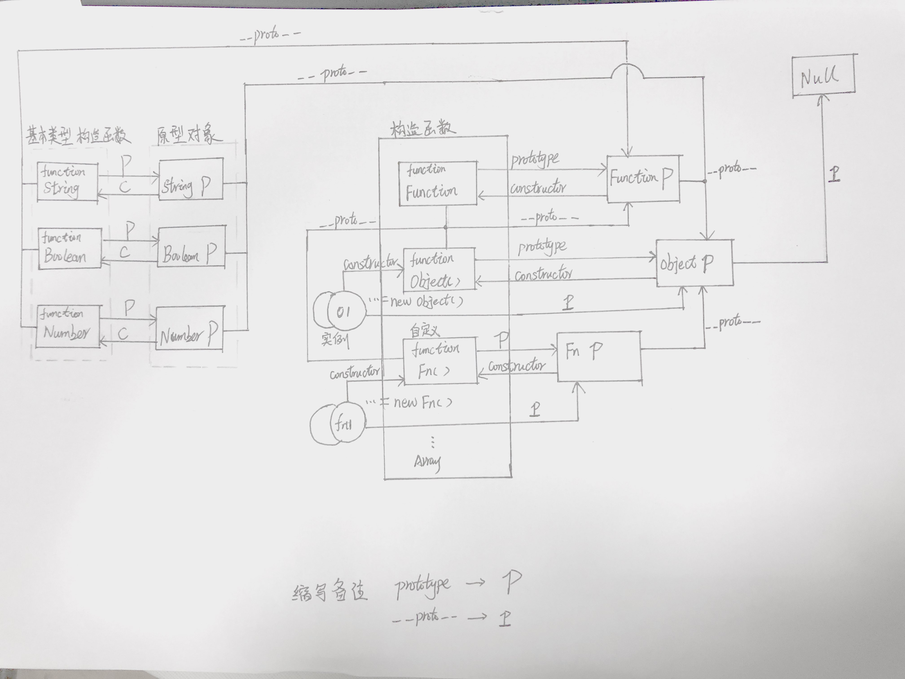

## JavaScript原型与原型链继承漫谈

### 一、楔子篇
JavaScript中万物皆对象，但对象之间也是有区别的。分为``函数对象``和``普通对象``。如何区分二者
  
>  ``定律一``：凡是通过new Function()创建的对象都是函数对象，
    其他都是普通对象（通常通过Object创建），可以通过typeof
    来判断。  
  ``定律二``：每个对象都有 ``__proto__ `` 属性，指向创建它的构造函数的原型对象,但只有函数对象才有``prototype`` 属性，指向函数的原型对象

```  javascript
var o1 = {}; 
var o2 =new Object();
var o3 = new f1();

function f1(){}; 
var f2 = function(){};
var f3 = new Function('str','console.log(str)');

console.log(typeof Object); //function 
console.log(typeof Function); //function  

console.log(typeof f1); //function 
console.log(typeof f2); //function 
console.log(typeof f3); //function   

console.log(typeof o1); //object 
console.log(typeof o2); //object 
console.log(typeof o3); //object
```

### 二、概念篇
 * 原型对象：在 JavaScript 中，每当定义一个对象（函数也是对象）时     候，对象中都会包含一些预定义的属性，其中每个函数对象都有一个prototype 属性，这个属性指向函数的原型对象。
 * 构造函数：用new运算符调用创建对象或类的实例的函数； 
 * 原型链：
   * 基本思想: 利用原型让一个引用类型继承另一个引用类型的属性和方法；
   * 实现机制: 每个实例对象（object ）都有一个私有属性（称之为``__proto__ ``）指向它的原型对象（prototype）。该原型对象也有一个自己的原型对象 ，层层向上直到一个对象的原型对象为 null。根据定义，null 没有原型，并作为这个原型链中的最后一个环节（来自 MDN web docs的官方解释）
### 三、理论实践篇
#### 程序案例
``` javascript
// 构造函数 Person
function Person(name, age, job) {
  this.name = name;
  this.age = age;
  this.job = job;
  this.sayName = function() { alert(this.name) } 
}
```
#### 1、构造函数概念
 > 1、创建过程
``` javascript
// 创建 person1、person2 两个实例
var person1 = new Person('Zaxlct', 28, 'Software');
var person2 = new Person('Mick', 23, 'Doctor');
// 实例的constructor 属性指向构造函数
console.log(person1.constructor == Person); // true
```
> 2、 其他js构造函数

步骤一是自定义构造函数创建对象的过程，在js世界里，还有其他构造函数如``Object, Array、Function、RegExp、String、Boolean、Number``等，这些构造函数原身都是``函数对象``即其原型都来自``Function.prototype``

```javascript
console.log(Number.__proto__ === Function.prototype ) // true
console.log(Number.constructor == Function )//true
console.log(Boolean.__proto__ === Function.prototype )// true
console.log(Boolean.constructor == Function )//true
console.log(String.__proto__ === Function.prototype ) // true
console.log(String.constructor == Function )//true
// 所有的构造器都来自于Function.prototype，甚至包括根构造器Object及Function自身
console.log(Object.__proto__ === Function.prototype ) // true
console.log(Object.constructor == Function )// true
// 所有的构造器都来自于Function.prototype，甚至包括根构造器Object及Function自身
console.log(Function.__proto__ === Function.prototype) // true
console.log(Function.constructor == Function )//true  
```
#### 2、 原型对象、构造函数、原型链之间关系
>  每个构造函数都有一个原型对象（prototype），原型对象都包含一个指向构造函数的指针（constructor），实例都包含一个指向原型对象的内部指针``__proto__``


```javascript
// 构造函数的prototype(原型对象)，该对象包含一个 constructor
// 指针，指向构造函数
console.log(Person.prototype.constructor == Person) 
// true
// 实例都有一个指向原型对象的内部指针
console.log(person1.__proto__ == Person.prototype); 
// true
// 在默认情况下，所有的原型对象都会自动获得一个 constructor（构造函数）属性，这个属性（是一个指针）指向 prototype 属性所在的函数（Person）
console.log(person1.constructor == Person.prototype.constructor); // true
```
>  ``倒推法``：原型对象具有构造函数属性（constructor），并指向构造函数，所以原型对象是构造函数的一个实例。
>`` 结论一``:  原型对象是普通对象，除了 Function.prototype 外 见例
```javascript
console.log(Person.prototype, JSON.stringify(Person.prototype)) //Person{}  {}
console.log(typeof Person.prototype) //Object
console.log(typeof Function.prototype) // Function，这个特殊
console.log(typeof Object.prototype) // Object
console.log(typeof Function.prototype.prototype) // undefined
```
> WHY ? 见``定律一`` 这里证明 ``Function.prototype``是函数对象唯一一个原型对象不是普通对象的类型
``` javascript
// Funtion.prototype 来源

var A  = new Function()
Function.prototype = A;
console.log(Function.prototype.constructor == Function)
// true
```
> 问题来了``Function.prototype``的``__proto__``指向``???``按照以上表述 该原型对象属于函数对象，理论上其隐式proto属性应该指向``Function.prototype``，ECMAScript 中定义函数也是对象，因此``Function.prototype.__proto__``指回``Object.prototype``,``Object.prototype.__proto__ == null``  保证正常原型链的结束。
```javascript
console.log(Function.prototype.__proto__ === Object.prototype, JSON.stringify(Function.prototype.__proto__)) // true {}
console.log(Object.prototype.__proto__)// null
```      


### 四、原型继承方法总结篇
> 
1、原型链
2、借构造函数
3、组合继承
4、原型式继承
5、寄生式继承
6、寄生组合式继承

### ``1、原型链``
> 原型继承是我们JS中最常用的一种继承方式；子类Chineseperson想要继承父类Person中的所有属性和方法（公有+私有），只需要让Chineseperson.prototype = new Person();即可原型继承的特点:它是把父类中``私有+公有``的都继承到了子类原型上（子类公有的）
``` javascript
  // 原型对象
  function Person(name) {
    this.name= name;
    this.friends = [];
  }
  Person.prototype.getName = function(){
    return this.name;
  }
  // 
  function Chineseperson(skin) {
      this.skin = skin;
  }
  Chineseperson.prototype = new Person(); // 字面量定义原型，原型链被强行断开
  Chineseperson.prototype.constructor = Chineseperson; //  构造函数属性 指回Chinaperson 构造完整的原型链

  var p1 = new Chineseperson('yellow');
  var p2 = new Chineseperson('white');
  p1.friends.push('lilei');
  p2.friends.push('Tom');
  
  // 问题一 为啥输出都一样的
  console.log('p1', p1.friends) // ["lilei", "Tom"]
  console.log('p2', p2.friends) // ["lilei", "Tom"]
  // 问题二
  console.log("p1:", p1.name, "p2:", p2.name); 
  // p1: undefined p2: undefined
  console.log('p1', p1.getName() ==  p2.getName()) // true
```
> ``总结：``
1、由于是原型继承，实例共享继承了原型的 私有、公有属性，故引用类型值的原型属性会被所有实例所共享;
2、创建子类型的实例时，无法向超类型的构造函数传递参数
### ``2、借构造函数``
> 基本思想： 子类构造函数内调用父类的构造函数，子类继承父类属性的副本；
```javascript
function Chineseperson(skin, name) {
  Person.call(this, name)
  this.skin = skin;
}
Chineseperson.prototype.getSkin = function(){
   return this.skin;
}
var p1 = new Chineseperson('yellow','limei');
var p2 = new Chineseperson('white', 'lily');
p1.friends.push('lilei');
p2.friends.push('Tom');
console.log("p1:", p1.name, "p2:", p2.name); 
// p1: limei p2: lily
console.log('p1', p1.friends) // ["lilei"]
console.log('p2', p2.friends) // [ "Tom"]
console.log('p1.skin:', p1.getSkin() ,"p2.skin:", p2.getSkin()) 
// p1.skin: yellow p2.skin: white 
// console.log('p1', p1.getName() , p2.getName()) // Error 
```
> ``结论``
1、解决了引用类型共享、父类型构造函数不能传参的问题
2、实例化子类型无法继承父类型原型属性
3、与用构造函数创建对象一样，无法实现函数复用
### ``3、组合继承``   
> 故名思义， 组合继承结合了原型链与借结构函数的优点组合的一种继承方式。原型链完成方法继承，构造函数继承属性；
```javascript
function Chineseperson(skin, name) {
    Person.call(this, name)
    this.skin = skin;
  }
  Chineseperson.prototype = new Person();
  Chineseperson.prototype.constructor = Chineseperson;
  Chineseperson.prototype.getSkin = function(){
    return this.skin;
  }
  var p1 = new Chineseperson('yellow','limei');
  var p2 = new Chineseperson('white', 'lily');
  p1.friends.push('lilei');
  p2.friends.push('Tom');
  console.log("p1:", p1.name, "p2:", p2.name); // p1: limei p2: lily
  console.log('p1', p1.friends) // ["lilei"]
  console.log('p2', p2.friends) // [ "Tom"]
  console.log('p1.skin:', p1.getSkin() , "p2.skin:",p2.getSkin())  
  console.log('p1.name:', p1.getName() ,"p2.name:" ,p2.getName())
  // console.log("p1.constructor == Person =", p1.constructor == Person)
```
> ``分析``
  1、二者方法合并解决了，两个方法独立使用的缺点
  2、混合模式，实际上并未杜绝引用共享的问题，分步解析子类实例化过程；
  第一步，调用Chineseperson原型对象赋值，实际上是原型链继承，此时引用类型属于共享；
  第二步，子类型的构造函数调用父类的构造函数从而继承了父类属性的副本，覆盖了原型链的属性
  3、问题来了 两次调用构造函数 有必要吗？
### ``4、原型式继承``
> 基本思想：  没有严格意义上的构造函数，基于现有对象创建新对象，并不会因此创建自定义函数。
```javascript
function object(o){
    var F = new Function();
    F.prototype = o;
    return new F();
  }
  var person = {
      name: 'lilei',
      friends: ['limei']
  }
  var anotherP = object(person);
  anotherP.name = 'wangqiang';
  anotherP.friends.push('wanggang')

  var anotherP2 = object(person);
  anotherP2.name = 'wangqiang1';
  anotherP2.friends.push('wanggang1')
  console.log(person.friends, person.name);
```
> ``总结``
  1、对父类对象进行``浅拷贝``赋值给子类对象的原型， 因此仍存在一个问题 引用类型仍被所有子类实例共享
  
### ``5、寄生式继承``
```javascript
function createAObj(original){
    var clone = object(original); // 父类original， 实例化子类 clone
    clone.sayHi = function() {
      console.log("hi, limei!")
    }
    return clone;
  }
  var anotherP =  createAObj(person);//object(person);
  anotherP.name = 'wangqiang';
  anotherP.friends.push('wanggang')
  
  var anotherP2 = createAObj(person); //object(person);
  anotherP2.name = 'wangqiang1';
  anotherP2.friends.push('wanggang1')

  console.log(person.friends, person.name);
  console.log(anotherP2.sayHi());
```
### ``6、寄生组合式继承``
> 主要解决组合继承，两次调用构造函数的问题，实现思路：利用构造函数继承父类私有属性，原型链混成继承，即原型对象继承父类方法不用实例化构造函数
> 高效调用一次父类构造函数，保持原型链不变， 目前``最理想``的基础方式
```javascript
 // Chineseperson.prototype = new Person();
 //Chineseperson.prototype.constructor = Chineseperson;
 inheritPrototype(Chineseperson, Person);
/*寄生组合式*/
function inheritPrototype(Chineseperson, Person) {
  var prototype = Object.create(Person.prototype);
  prototype.constructor = Chineseperson;
  Chineseperson.prototype = prototype;
}
```
### 五、总结篇
* 原型与原型链总结
  * 对象分 函数对象和普通对象，``__proto__``是对象共有属性，指向创建该对象的构造函数的原型对象， 只有函数对象才有 ``prototype``属性，指向该函数的原型对象； 
  * 原型链 其实是实例与原型对象之间的关系，与构造函数无关
  * 实例的构造函数属性（constructor）指向构造函数， 原型对象是构造函数的实例化，除了Function.prototype是函数对象，其他都是普通对象
* 继承方法总结
  *  原型链
    * 变向的实现属性共享； 但引用属性也被共享且无法向父类型构造函数传参数  
  * 借构造函数
    * 解决引用类型共享、无法给父类构造函数传参问题，但父类类原型的方法对子类不可见，且子类调用父类构造函数创建父类属性和方法的副本，不利于函数复用；
    * 组合继承 (普遍应有的继承方法)
      * 通过原型继承原型属性和方法；通过构造函数实现实例属性的继承， 但是需要二次调用构造函数 
    * 原型式继承
    * 基于现有对象创建新对象，仍存在引用类型共享 
   * 寄生式继承
     *  类似工厂模式。创建一个仅用封装继承过程的函数 
   * 寄生组合式继承
     *  解决两次调用超类构造函数的问题，最理想的继承方法