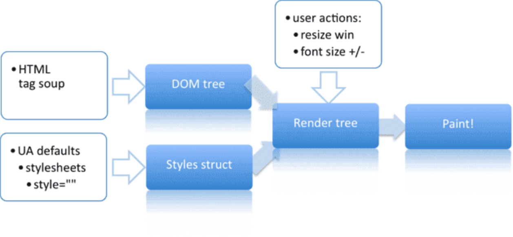

## 浅谈重排与重绘
#### 一、探讨页面呈现流

---
**step1:** `DOM树`--浏览器把获取到的HTML代码解析成1个DOM树，HTML中的每个tag都是DOM树中的1个节点，根节点就是我们常用的document对象。DOM树里包含了所有HTML标签，包括display:none隐藏，还有用JS动态添加的元素等;

**step2:** `结构树`--浏览器把所有样式(用户定义的CSS和用户代理)解析成样式结构体，在解析的过程中会去掉浏览器不能识别的样式;

**step3:** `渲染树`--DOM树&结构树结合后构建成渲染树，融合了DOM树，其能识别样式，每个渲染树中的node节点都有样式，但是区别DOM树，其不包含display:none、及head节点，只因这些节点不能呈现在页面上

**step4:** `页面绘制`--渲染树构建完毕后，浏览器就可以根据渲染树来绘制页面

#### 二、定义篇是什么？
1、**重排（reflow）** 又名回流,指的是浏览器为了重新渲染部分或全部的文档而重新计算文档中元素的`位置`和`几何结构`的过程。  
2、**重绘（repaint）**当页面中的元素只需要更新`样式风格`但不影响布局，这个过程叫重绘。

#### 三、触发条件
##### 1、重排触发条件
1、影响元素布局和几何属性的css属性[参考链接](https://csstriggers.com/)

* 盒模型相关属性（width、height、margin、padding、border、display等）
* 定位及浮动相关属性（top、left、bottom、right、position、float等）
* 改变文字结构的属性（text-align、overflow、font-size、line-height、vertical等）

2、用户操作行为（调整窗口的大小、改变浏览器字体大小、读取元素的属性）   
3、样式表的变动	（font类样式修改、display等）	
4、元素内容的变化，比如输入控件    
5、dom操作（增、删、移动、显示隐藏）    
##### 2、重绘触发条件
1、修改元素的样式相关属性  
如：background、color、visibility, *:hover引起的颜色变化
#### 四、如何降低重排和重绘的影响
##### 1、浏览器优化

__浏览器__为了防止多次reflow操作放在循环中而引发浏览器假死，做了一个聪明的小动作。既收集reflow操作到``缓存队列``中直到一定的规模或者过了特定的时间，再一次性地flush队列，反馈到renderTree中，这样就将多次的reflow操作减少为少量的reflow。（[见DEMO测试一](./index.html)）

__问题:__如果我们想要实时获取一次reflow过后元素变动过后的值呢？这个时候浏览器为了获取真实的值就不得不立即flush缓存的队列（[见DEMO测试二](./index.html)）

* offsetTop/Left/Width/Height
* scrollTop/Left/Width/Height
* clientTop/Left/Width/Height
* getComputedStyle(), or currentStyle in IE

##### 2、代码层级优化

* 尽量减少触发reflow操作
	* 尽可能在DOM末梢通过改变class来修改元素的style属性 
	* 避免设置多项内联样式
	* 设置动画元素position属性为fixed/absolute:脱离文档流，只影响当前元素
	* 牺牲平滑度满足性能
	* 避免使用table进行布局：table的每个元素的大小以及内容的改动，都会导致整个table进行重新计算，造成大幅度的repaint或者reflow。改用div则可以进行针对性的repaint和避免不必要的reflow
	* 避免在css中使用运算式；
* 替代会触发reflow的属性,变reflow为repaint

？？**如何减少触发reflow的操作** ？？

主旨：减少对renderTree的操作，renderTree即渲染树是一个包含节点内容和样式结构的所有``可见``node节点，这是renderTree和DomTree之间最大的区别，也是减少触发reflow操作的关键，即合并多次reflow操作，一次反馈到renderTree上。

方法：

* 直接用操作class变更样式[demo](./combine.html)
* 让频繁reflow的元素“离线”
	* 使用DocumentFragment进行缓存操作,引发一次回流和重绘；
	* 使用display:none，只引发两次回流和重绘；
	* 使用cloneNode(true or false) 和 replaceChild 技术，引发一次回流和重绘 
	
---

简述：

**DomcumentFragment**--Dom规定文档片段（DocumentFragment）是一种“轻量级”的文档，可以包含和控制节点，但不会像完整的文档那样占用额外的资源-- `游离DOM`。虽然不能把文档片段直接添加到文档中，但是可以将它作为一个“仓库”来使用，即可以在里面保存将来可能会添加到文档中的节点。从而达到一次reflow、repaint[demo]()

**display**: 隐藏 等效于将node在renderTree中失效--一次reflow、repaint；显示 等效于将node节点在renderTree中渲染-一次reflow、repaint

**cloneNode**: 原理等同于DomcumentFragment，先建立一个存储dom的‘仓库’，再一次性渲染
	
---
* 减少对flush缓存队列属性的访问次数，如果一定要访问，可使用变量缓存

主旨：减少不必要触发reflow的条件

？？**替代会触发reflow和repaint的属性**？？

可以将一些会触发回流的属性替换，来避免reflow。比如用translate代替top，用opacity替代visibility；[demo](http://localhost:8000/replace.html)

<table>
	<tr>
		<td>常见的重排属性</td>
		<td></td>
		<td></td>
		<td></td>
	</tr>
	<tr><td align="center">width</td><td align="center">height</td><td align="center">padding</td><td align="center">margin</td></tr><tr><td align="center">display</td><td align="center">border-width</td><td align="center">border</td><td align="center">top</td></tr><tr><td align="center">position</td><td align="center">font-size</td><td align="center">float</td><td align="center">text-align</td></tr><tr><td align="center">overflow-y</td><td align="center">font-weight</td><td align="center">overflow</td><td align="center">left</td></tr><tr><td align="center">font-family</td><td align="center">line-height</td><td align="center">vertical-align</td><td align="center">right</td></tr><tr><td align="center">clear</td><td align="center">white-space</td><td align="center">bottom</td><td align="center">min-height</td></tr>
</table>

<table><thead><tr><th align="center">常见的重绘元素</th><th align="center"></th><th align="center"></th><th colspan="2" align="center"></th></tr></thead><tbody><tr><td align="center">color</td><td align="center">border-style</td><td align="center">visibility</td><td align="center">background</td></tr><tr><td align="center">text-decoration</td><td align="center">background-image</td><td align="center">background-position</td><td align="center">background-repeat</td></tr><tr><td align="center">outline-color</td><td align="center">outline</td><td align="center">outline-style</td><td align="center">border-radius</td></tr><tr><td align="center">outline-width</td><td align="center">box-shadow</td><td colspan="2" align="center">background-size</td></tr></tbody></table>

#### 总结
对于DOM结构中的各个元素都有自己的盒子（模型），这些都需要浏览器根据各种样式（浏览器的、开发人员定义的等）来计算并根据计算结果将元素放到它该出现的位置，这个过程称之为reflow；当各种盒子的位置、大小以及其他属性，例如颜色、字体大小等都确定下来后，浏览器于是便把这些元素都按照各自的特性绘制了一遍，于是页面的内容出现了，这个过程称之为repaint。

可见这两个东东对浏览器渲染页面是很重要的啊，都是会影响性能的，因此我们需要了解一些常见的会引起repaint和reflow的一些操作，并且应该尽量减少以提高渲染速度。

##### 参考资料
* [Reflows & Repaints: CSS Performance making your JavaScript slow?](http://www.stubbornella.org/content/2009/03/27/reflows-repaints-css-performance-making-your-javascript-slow/)
* [高性能WEB开发-页面呈现、重绘、回流](https://kb.cnblogs.com/page/64064/8/)

