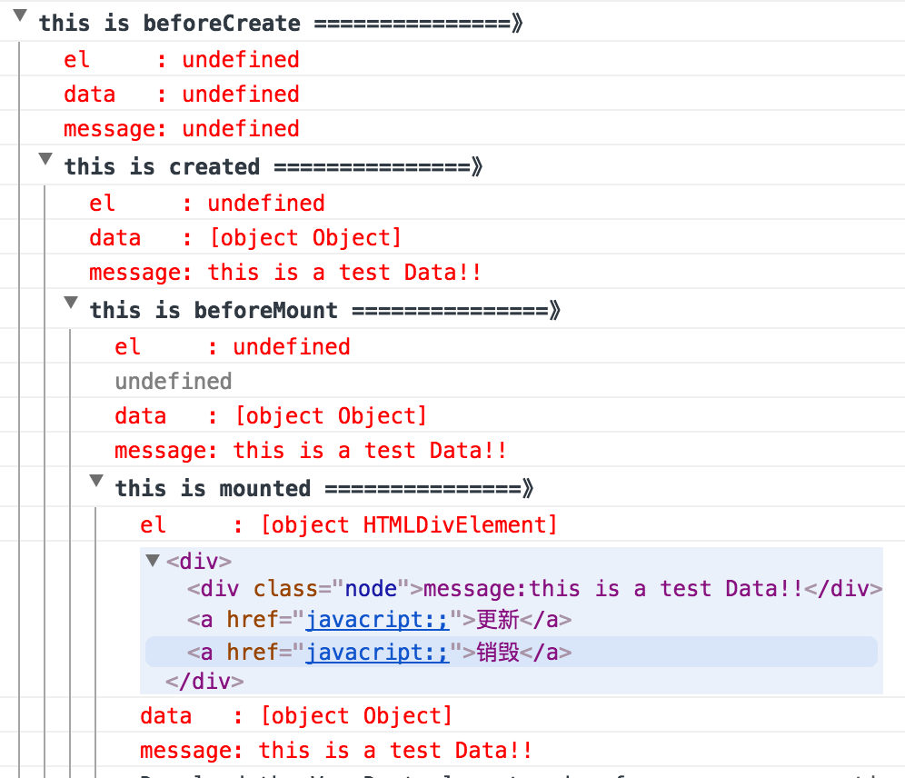
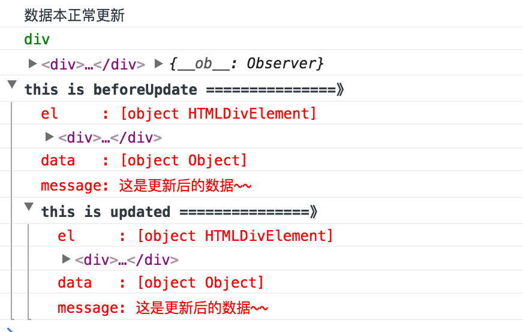
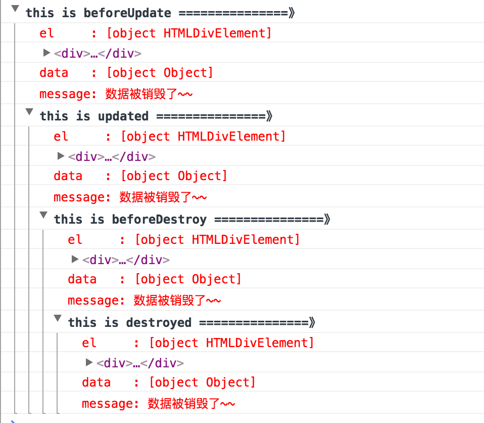
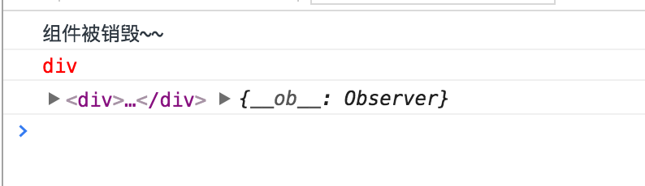

# VUE 1.0 迁移 2.0 所遇到的洼地
## 1、生命周期对比表格
<div style="display: block;width: 700px;max-height: 800px;white-space: nowrap;">
	<span style="display: inline-block; width: 300px">
		
	</span>
	<span style="display: inline-block; width: 300px">
		
	</span>
</div>

|	vue1.x		| 	vue2.x   	|	 		基本描述															|
|	:---		|		---	 	|		     ---															|
|	init		| beforeCreate  |	组件实例刚被创建，其属性如data等计算之前										|
|	created		|	created		|	组件实例创建完毕，	属性已绑定，但dom还未生成,Vue.$el属性暂不存在				|
| beforeCompile |    - 			|	模板编译之前																|
|	-			| beforeMount   |	模板挂载之前																|
|  complied		|	 -			|	模板编译之后																|
|  ready		|   mounted 	|	模板编译/挂载之后（不能保证组件完全在document里）							|
|	-			|	beforeUpdate|	组件更新之前																|
|	-			|	updated		|	组件更新之后																|
|	-			|	activated	|	for keep-alive,组件被激活使用												|
|	—			|	deactivated |	for keeo-alive,组件被移除使用												|
|	attached	|	-			|	废弃																		|
|	deattached	|	-			|	废弃																		|
| beforeDestroy | beforeDestroy |	组件被销毁前调用															|
| destroy 		| destroy 		|	组件被销毁后调用															|

---
## 2、探究生命周期

> vue所有功能的实现都是围绕其生命周期进行的，在生命周期的不同阶段调用对应的钩子函数可以实现组件数据管理和DOM渲染两大重要功能

### 第一种创建实例的方式
```javascript 
<template>
    <div>
        <div class="node">message:{{message}}</div>
        <a href="javacript:;" @click="update">更新</a>
        <a href="javacript:;" @click="destroy">销毁</a>
    </div>
</template>
<script>
    import Axios from 'axios' ;     // 这是一个轻量级的ajax库，import是es6模块导入的语法。
    export default { 
    	data(){
        	return {
        		message:"this is a test Data!!",
                isDestroy:false
        	}
        }, 
        beforeCreate: function () {
            console.group('this is beforeCreate ===============》');
            console.log("%c%s", "color:red" , "el     : " + this.$el); //undefined
            console.log("%c%s", "color:red","data   : " + this.$data); //undefined 
            console.log("%c%s", "color:red","message: " + this.message);// undefined
        },
        created: function () {
            console.group('this is created ===============》');
            console.log("%c%s", "color:red","el     : " + this.$el); //undefined
            console.log("%c%s", "color:red","data   : " + this.$data); //已被初始化 
            console.log("%c%s", "color:red","message: " + this.message); //已被初始化
        },
        beforeMount: function () {
            console.group('this is beforeMount ===============》');
            console.log("%c%s", "color:red","el     : " + (this.$el)); //undefined
            console.log(this.$el);
            console.log("%c%s", "color:red","data   : " + this.$data); //已被初始化  
            console.log("%c%s", "color:red","message: " + this.message); //已被初始化  
        },
        mounted: function () {
            console.group('this is mounted ===============》');
            console.log("%c%s", "color:red","el     : " + this.$el); //已被初始化
            console.log(this.$el);    
            console.log("%c%s", "color:red","data   : " + this.$data); //已被初始化
            console.log("%c%s", "color:red","message: " + this.message); //已被初始化 
        },
        beforeUpdate: function () {
            console.group('this is beforeUpdate ===============》');
            console.log("%c%s", "color:red","el     : " + this.$el);
            console.log(this.$el);   
            console.log("%c%s", "color:red","data   : " + this.$data); 
            console.log("%c%s", "color:red","message: " + this.message); 
        },
        updated: function () {
            console.group('this is updated ===============》');
            console.log("%c%s", "color:red","el     : " + this.$el);
            console.log(this.$el); 
            console.log("%c%s", "color:red","data   : " + this.$data); 
            console.log("%c%s", "color:red","message: " + this.message); 
        },
        beforeDestroy: function () {
            console.group('this is beforeDestroy ===============》');
            console.log("%c%s", "color:red","el     : " + this.$el);
            console.log(this.$el);    
            console.log("%c%s", "color:red","data   : " + this.$data); 
            console.log("%c%s", "color:red","message: " + this.message); 
        },
        destroyed: function () {
            console.group('this is destroyed ===============》');
            console.log("%c%s", "color:red","el     : " + this.$el);
            console.log(this.$el);  
            console.log("%c%s", "color:red","data   : " + this.$data); 
            console.log("%c%s", "color:red","message: " + this.message)
        }
    }
</script>
```
    
    
    
    

>PS: 这种创建实例的方法中 beforeMount 打印的结果，与预期不符合???? why!!!;

### 换一种创建实例的方式


```javascript
    <script>
    let newVue = new  Vue({
        el :"#annther_way",
        beforeMount(){
            console.group('this is beforeMount ===============》');
            console.log("%c%s", "color:red","el     : " + (this.$el)); //已被初始化
            console.log(this.$el);
            console.log("%c%s", "color:red","data   : " + this.$data); //已被初始化  
            console.log("%c%s", "color:red","message: " + this.message); //已被初始化  
        }
    })
    </script>
```


> 总结 console 结果	
	*  ** beforeCreate: ** 即将创建,此阶段为组件实例初始化之后，此时的数据观察和事件机制都未形成 
	*  ** created: ** 组件实例已经创建完成之后被调用。在这一步，实例已完成以下的配置：数据观测(data observer)，属性和方法的运算， watch/event 事件回调。然而，挂载阶段还没开始，$el 属性目前不可见。
        > > 首先，运行new Vue()的时候，会进入代码src/core/instance/index.js的Vue构造方法中，并执行this._init()方法。在_init中，会对各个功能进行初始化，并执行beforeCreate和created两个生命周期方法。核心代码如下:
        ```javacript
            initLifecycle(vm)
            initEvents(vm)
            callHook(vm, 'beforeCreate')
            initState(vm)
            callHook(vm, 'created')
            initRender(vm)
        ```
        可以看到，到当执行钩子函数created时，complier还没有将template解析成render方法，DOM自然不能获取;

	* **beforeMount: ** 在挂载开始之前被调用：相关的 render 函数首次被调用。
	*  ** mounted: ** el 被新创建的 vm.$el 替换，并挂载到实例上去之后调用该钩子。如果 root 实例挂载了一个文档内元素，当 mounted 被调用时 vm.$el 也在文档内。
    *  ** beforeUpdate: ** 数据更新时调用，发生在虚拟 DOM 重新渲染和打补丁之前。 可以在这个钩子中进一步地更改状态，这不会触发附加的重渲染过程。
    * ** updated: ** 由于数据更改导致的虚拟 DOM 重新渲染和打补丁，在这之后会调用该钩子。当这个钩子被调用时，组件 DOM 已经更新，所以你现在可以执行依赖于DOM操作。然而在大多数情况下，你应该避免在此期间更改状态，因为这可能会导致更新无限循环。该钩子在服务器端渲染期间不被调用。
    * ** beforeDestroy ** 实例销毁之前调用。在这一步，实例仍然完全可用;
    * ** destroyed ** Vue 实例销毁后调用。调用后，Vue 实例指示的所有东西都会解绑定，所有的事件监听器会被移除，所有的子实例也会被销毁。 该钩子在服务器端渲染期间不被调用。
